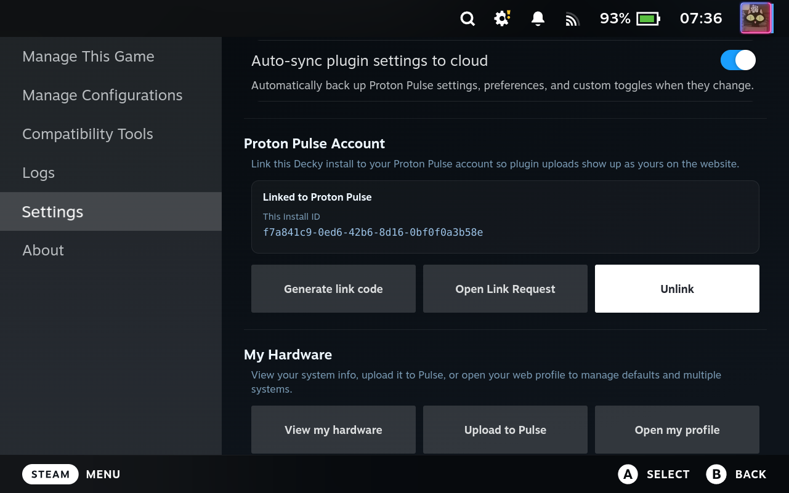

# Decky Proton Pulse

| Autobuild | Status |
|---|---|
| Ubuntu | [](https://github.com/mdeguzis/decky-proton-pulse/actions/workflows/autobuild.yml) |
| Debian | [](https://github.com/mdeguzis/decky-proton-pulse/actions/workflows/build-debian.yml) |
| Arch Linux | [](https://github.com/mdeguzis/decky-proton-pulse/actions/workflows/build-arch.yml) |
| Fedora | [](https://github.com/mdeguzis/decky-proton-pulse/actions/workflows/build-fedora.yml) |
| Termux | [](https://github.com/mdeguzis/decky-proton-pulse/actions/workflows/build-termux.yml) |
| Windows toolchain | [](https://github.com/mdeguzis/decky-proton-pulse/actions/workflows/build-windows.yml) |

Windows CI currently validates that the repo toolchain can install and build on a GitHub-hosted Windows runner. It is not a claim that the Decky plugin runtime or hardware-detection backend is fully supported on Windows.

[](https://mdeguzis.github.io/decky-proton-pulse/)
[](https://mdeguzis.github.io/decky-proton-pulse/)
[](https://www.proton-pulse.com/)

A [Decky Loader](https://github.com/SteamDeckHomebrew/decky-loader) plugin for Steam Deck that pulls [ProtonDB](https://www.protondb.com) reports for the game in front of you, scores them against your hardware, and lets you apply useful launch options without typing them by hand.

> Website: **<https://www.proton-pulse.com/>** — the companion web app now lives on its own domain. If you had the old `mdeguzis.github.io/proton-pulse-data/*` URLs bookmarked, please update them. The plugin itself already points at the new host.

Browse community reports, Pulse configs, and per-game compatibility data on the **[Proton Pulse site](https://www.proton-pulse.com/)** - works on mobile with a collapsible left-side nav.

Coverage policy: overall Python and TypeScript coverage must stay at or above `90%`, and pull requests must keep changed-line coverage at `95%` or higher.

## Screenshots

see: [UI screenshot gallery](https://github.com/mdeguzis/decky-proton-pulse/wiki/UI-Screenshot-Gallery)

---

## Acknowledgments & Credits

Proton Pulse would not exist without the open-source projects below. Parts of this plugin were borrowed from them directly, and plenty more was shaped by their ideas and prior work.

| Project | Author | License |
|---|---|---|
| [ProtonDB Badges (protondb-decky)](https://github.com/OMGDuke/protondb-decky) | OMGDuke | — |
| [Decky Proton Launch](https://github.com/moi952/decky-proton-launch) | moi952 | — |
| [Wine Cellar (decky-wine-cellar)](https://github.com/FlashyReese/decky-wine-cellar) | FlashyReese | MIT |
| [SteamGridDB Decky Plugin (decky-steamgriddb)](https://github.com/SteamGridDB/decky-steamgriddb) | SteamGridDB | GPL-3.0-or-later |

If you find Proton Pulse useful, please consider starring or contributing to these upstream projects as well.

---

## What it does

Getting Proton launch options right usually means opening ProtonDB, reading a pile of reports, guessing which ones match your hardware, and then copying flags into Steam by hand. Proton Pulse handles that from the Steam Deck UI:

1. Open the plugin from the **Quick Access sidebar** or navigate to a game in your library.
2. The plugin fetches ProtonDB reports and scores them against your GPU, driver, and Proton version.
3. Pick a report and press **Apply**. Proton Pulse writes the launch options straight to that game through Steam's CEF API.

You can also review, edit, or clear the options later from the sidebar.

## Optional Proton Pulse Account Link

Linking the Decky plugin to a Proton Pulse account is optional. The plugin works without it for local report browsing, scoring, and launch-option management.

- **On the website:** Steam login is only the sign-in method for your Proton Pulse account.
- **In the Decky plugin:** linking uses a Proton Pulse install ID plus a short link code.
- **Privacy boundary:** the plugin does not upload Steam profile names or Steam usernames, and Steam auth is not used as the plugin identity.

After linking, uploads from that Decky install can show up as yours on the website, and the website can manage synced systems and reports for the same Proton Pulse user.



## Features

* **ProtonDB report fetching** - pulls from cached, mirrored, and live ProtonDB sources so the plugin still has something useful to show when one source comes up empty
* **Native Pulse reports** - submit your own compatibility report directly from the plugin; hardware (CPU, GPU, RAM, VRAM, driver, kernel, OS, resolution) is captured automatically so you only need to pick a rating and Proton version
* **Hardware-aware scoring** - ranks reports by GPU vendor, driver version, Proton build, report age, and compatibility tier
* **Launch option management** - apply, review, edit, and clear launch options directly from the Steam Deck UI
* **Saved configurations** - keep reusable per-game setups with custom variables and a live launch preview
* **Compatibility tool management** - browse, install, refresh, and manage Proton and GE versions without leaving the plugin
* **Detailed report browsing** - open full report cards with filters, diagnostics, vote counts, and score breakdowns
* **ProtonDB contribution helpers** - vote on reports and prep system info for ProtonDB submissions from inside the plugin
* **ProtonDB badge** - shows the game's ProtonDB tier at a glance
* **System detection** - detects CPU, RAM, GPU, driver, kernel, distro, and custom Proton versions automatically
* **Sidebar tools** - quick access to settings, logs, cache tools, and plugin controls from the Decky panel
* **Translations** - interface support for 10 languages, with coverage tracked in generated build metrics
* **Diagnostics and logging** - built-in logs, cache inspection, performance metrics, and backend troubleshooting support

## Translation Coverage

<!-- translation-coverage:start -->
Generated from [metrics/translation-coverage.json](metrics/translation-coverage.json) during `pnpm run build`.

Proton Pulse supports 19 languages. Translation coverage is measured during build and can be enforced with `pnpm run check-translations` (90% minimum).

| Language | Code | Coverage | Status |
|---|---|---|---|
| English | en | 100.0% (canonical) | canonical |
| Deutsch | de | 94.0% | pass |
| Español | es | 94.0% | pass |
| Français | fr | 94.0% | pass |
| Italiano | it | 94.0% | pass |
| 日本語 | ja | 94.0% | pass |
| 한국어 | ko | 94.0% | pass |
| Nederlands | nl | 94.0% | pass |
| Polski | pl | 94.0% | pass |
| Português (BR) | pt-BR | 94.0% | pass |
| Русский | ru | 94.0% | pass |
| Türkçe | tr | 94.0% | pass |
| Українська | uk | 94.0% | pass |
| Svenska | sv | 94.0% | pass |
| Čeština | cs | 94.0% | pass |
| ภาษาไทย | th | 94.0% | pass |
| Tiếng Việt | vi | 94.0% | pass |
| 简体中文 | zh-CN | 94.0% | pass |
| 繁體中文 | zh-TW | 94.0% | pass |
<!-- translation-coverage:end -->

Want to help translate? See `src/lib/translations/` for the translation files.

## Installation

Proton Pulse currently supports two installation routes:

### Install From Source

Use this route if you want to build locally, tweak the plugin, or deploy straight to your Steam Deck.

```bash
git clone https://github.com/mdeguzis/decky-proton-pulse.git
cd decky-proton-pulse
make setup
make build
DECK_IP=192.168.1.x make deploy
```

Useful variants:

```bash
make watch
DECK_IP=192.168.1.x make deploy-reload
```

See the [Developer Guide](https://github.com/mdeguzis/decky-proton-pulse/wiki/Developer-Guide) for the full setup and deployment workflow.

### Install From Release ZIP

Use this route if you just want a published build and do not need the source tree.

1. Download the latest plugin ZIP from the [Releases page](https://github.com/mdeguzis/decky-proton-pulse/releases).
2. Open Decky Loader on your Steam Deck.
3. Use Decky Loader's manual ZIP install flow and select the downloaded release archive.
4. Restart Decky Loader or Steam if the plugin does not appear immediately.

### Quick Start

```bash
git clone https://github.com/mdeguzis/decky-proton-pulse.git
cd decky-proton-pulse
bash scripts/dev-setup.sh
```

Versioning uses a single source of truth:

- `VERSION`

Normal build and deploy commands sync that value into `package.json` and `pyproject.toml` automatically.

### Requirements

* Steam Deck with [Decky Loader](https://github.com/SteamDeckHomebrew/decky-loader) installed
* Node.js 24 and pnpm v9+ (for building from source)
* Python 3.x with [uv](https://github.com/astral-sh/uv)

## Documentation

* [Proton Pulse Site](https://www.proton-pulse.com/) — browse community reports, Pulse configs, and per-game data
* [Developer Guide](https://github.com/mdeguzis/decky-proton-pulse/wiki/Developer-Guide) — setup, build, deploy, testing, CEF debugging
* [Architecture](https://github.com/mdeguzis/decky-proton-pulse/wiki/Architecture) — file-by-file code breakdown and ownership boundaries
* [System Design](https://github.com/mdeguzis/decky-proton-pulse/wiki/System-Design) — end-to-end flow diagrams, data ownership, scoring model
* [Scoring Algorithm](https://github.com/mdeguzis/decky-proton-pulse/wiki/Scoring-Algorithm) — how reports are weighted and ranked
* [API Reference](https://github.com/mdeguzis/decky-proton-pulse/wiki/API-Reference) — Python callables and TypeScript interfaces
* [ProtonDB Data Resolution](https://github.com/mdeguzis/decky-proton-pulse/wiki/ProtonDB-Data-Resolution) — app ID resolution, mirror misses, and live fallback
* [Local dev notes](docs/dev/toolchain-and-ci.md) — Node 24, CI, remote Deck helpers, and CEF captures

## Troubleshooting

### Connect To Steam CEF Remote Debugging

If you need to inspect Deck UI patches, injected buttons, or console errors live on the Deck, you can enable Steam's CEF remote debugger and connect from your desktop browser.

1. Enable the remote debugger on the Deck:

```bash
DECK_IP=192.168.1.x make cef-debug-enable
```

2. Open the debugger endpoint from your desktop browser:

```text
http://192.168.1.x:8081
```

3. If your browser does not auto-discover the targets, open:

```text
http://192.168.1.x:8081/json
```

That page lists the active Steam CEF targets and their DevTools URLs.

Tips:

* Keep `make get-logs` handy in another terminal so you can compare frontend console behavior with the plugin log.
* If you are debugging a game page patch, open the game page first, then refresh the target list so the correct CEF view is visible.
* Use the inspector console to confirm route changes, DOM anchor selection, and injected button state when UI patches do not show up where expected.

## License

See [LICENSE](https://github.com/mdeguzis/decky-proton-pulse/blob/main/LICENSE).
